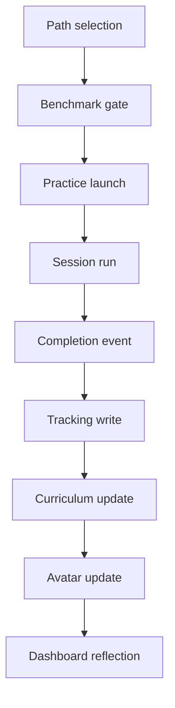

# Session Flow Map (Canonical)

Purpose: define one source of truth for how a practice session moves through the system from path intent to reflected outcomes.

Primary chain:

`Path selection -> benchmark -> practice launch -> session run -> completion event -> tracking -> curriculum update -> avatar update -> dashboard reflection`

## Canonical Flow Diagram

## Stage Ownership Map

| Stage | Component entrypoint | Store source of truth | Emitted side effects |
|---|---|---|---|
| Path selection | `src/components/NavigationSection.jsx` -> `src/components/PathOverviewPanel.jsx` (`handleBegin`) | `useNavigationStore` (`activePath`, `pendingAttempt*`) | Persists path/run metadata and selected schedule slots |
| Benchmark gate | `src/components/PathOverviewPanel.jsx` + `src/components/HomeHub.jsx` slot gating surfaces | `useBreathBenchmarkStore` + path constraints from `useNavigationStore` | Blocks/permits launch, records benchmark attempt completion |
| Practice launch | `src/components/HomeHub.jsx` (`handleStartPractice`) -> `src/state/uiStore.js` (`setPracticeLaunchContext`) -> `src/App.jsx` (`handleSectionSelect`) | `useUiStore` (`practiceLaunchContext`) | Navigates to Practice and seeds run context/overrides |
| Session run | `src/components/PracticeSection.jsx` + `src/components/practice/PracticeOptionsCard.jsx` | Runtime session state in `PracticeSection` + `useSessionOverrideStore`/tempo stores | Starts timers/audio, updates live session metrics |
| Completion event | `src/components/PracticeSection.jsx` completion handlers -> `src/components/practice/SessionSummaryModal.jsx` | `useCurriculumStore` active session + local session summary state | Stops runtime engines, opens summary modal |
| Tracking write | `src/services/sessionRecorder.js` (`recordPracticeSession`) | `useProgressStore` (canonical session history) + `useNavigationStore` adherence log | Writes normalized event payload, updates aggregates/selectors |
| Curriculum update | `src/components/PracticeSection.jsx` completion path -> curriculum APIs | `useCurriculumStore` (`legCompletions`, day status, active practice session) | Marks leg complete and updates completion windows |
| Avatar update | `src/components/HomeHub.jsx` + `src/components/avatarV3/AvatarComposite.jsx` | `useAvatarV3State`, `usePathStore`, `useLunarStore`, `useProgressStore` | Recomputes stage/path presentation and progression visuals |
| Dashboard reflection | `src/components/HomeHub.jsx` + reports/tiles | Derived selectors from `useProgressStore`, `useCurriculumStore`, `useNavigationStore`, `useTrackingStore` | Renders cards, trends, adherence summaries, and next actions |

## Single-Failure Nodes And Fail-Safe Behavior

Target policy: training start should remain available even if one subsystem is invalid.

| Failure node | Failure symptom | Fail-safe behavior (target) |
|---|---|---|
| Path selection contract validation | Begin path blocked by malformed slot data | Allow direct Practice launch without path contract, show non-blocking warning |
| Benchmark gate resolution | Benchmark state missing/corrupt | Permit manual start in unrestricted mode and log benchmark as unknown |
| Launch context handoff | `practiceLaunchContext` stale/missing | Fallback to `practiceId='breath'`, default duration, no overrides |
| Completion write path | Summary closes but session not recorded | Queue retry payload locally and still present completion confirmation |
| Curriculum leg commit | Session completes but day not updated | Preserve session in tracking and mark curriculum update as deferred |
| Dashboard selectors | Home hub tiles crash on derived selector mismatch | Render safe defaults (`0`, `n/a`) and keep navigation actions enabled |

## Debug Checklist (Before/After)

Use this when debugging any break in the canonical chain.

1. Before: capture launch source
   - Confirm initiating surface (`Navigation` path begin vs `HomeHub` slot start).
   - Confirm intended practice id and run id in relevant store snapshots.
2. Before: confirm gate predicates
   - Benchmark state present and parseable.
   - Slot/time constraints valid for selected path.
3. During run: confirm session is actually active
   - Practice view mounted (`src/components/PracticeSection.jsx`).
   - Timer/audio state transitions occur.
4. Completion boundary: confirm one concrete completion event
   - Summary modal opens.
   - Completion payload contains practice id, duration, timestamp.
5. After: confirm write spine
   - `recordPracticeSession` invoked once for the completed session.
   - Session appears in `useProgressStore` history.
6. After: confirm secondary updates
   - Curriculum leg completion updated (if session is curriculum-owned).
   - Navigation adherence log updated when session is slot-bound.
7. After: confirm reflection surfaces
   - Home hub cards render without crash.
   - Dashboard reflects updated totals/adherence within expected refresh cycle.

## Reference Inputs

- `docs/CRITICAL_FLOWS.md`
- `docs/ARCHITECTURE.md`
- `tests/smoke/critical-flows.spec.ts`
